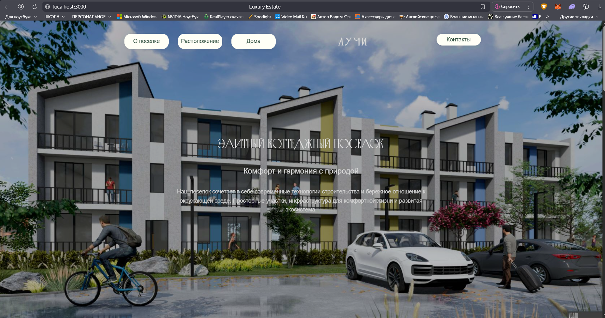
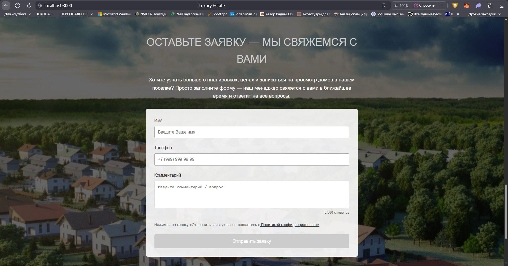

# 🏠 FeoHouses Project - Руководство по запуску

## 📋 Предварительные требования

Перед началом работы убедитесь, что на вашем компьютере установлено:

- **Git** - для клонирования репозитория
- **Node.js** (версия 16 или выше) - для фронтенда React
- **.NET 6.0 SDK** или выше - для бэкенда ASP.NET
- **Docker** (опционально) - для запуска базы данных в контейнере
- **SQL Server** (альтернатива Docker) - LocalDB, Express или Developer Edition

## 🚀 Быстрый старт

### Клонирование репозитория

git clone https://github.com/SxnchZi/FeoHousesProject.git
cd FeoHousesProject

### ⚙️ Запуск backend'а

cd RealEstateBackend
dotnet restore
dotnet ef database update
dotnet run &

### 📌 Бэкенд будет доступен по адресу:

https://localhost:7000
http://localhost:5000

### 🐳 Запуск БД

**Вариант A**: Использование LocalDB

Убедитесь, что строка подключения в RealEstateBackend/appsettings.json соответствует:

{
  "ConnectionStrings": {
    "DefaultConnection": "Server=(localdb)\\mssqllocaldb;Database=FeoHousesDB;Trusted_Connection=true;"
  }
}

**Вариант B**: Ручная настройка SQL Server

- Установите SQL Server

- Создайте базу данных FeoHousesDB

- Обновите строку подключения в appsettings.json

### ⚛️ Запуск frontend'a

cd ../client
npm install
npm start

### 📌 Фронтенд будет доступен по адресу:

https://localhost:3000

### ⚛️ Внешний вид

## 📞 Поддержка

Если возникли проблемы:

- Проверьте, что все порты свободны;
- Убедитесь, что все зависимости установлены;
- Проверьте логи Docker контейнера: docker logs feohouses_db;
- Для дополнительной помощи обратитесь к документации проекта.
